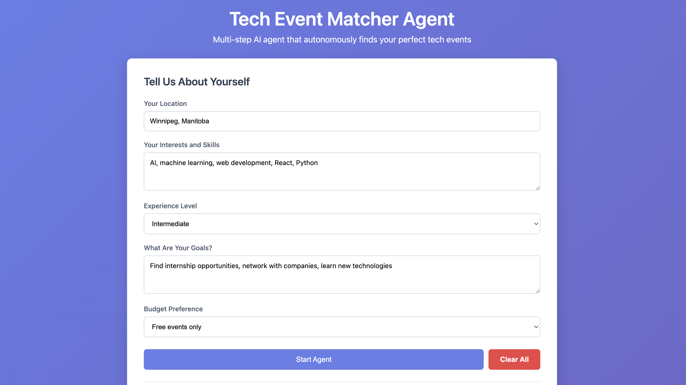
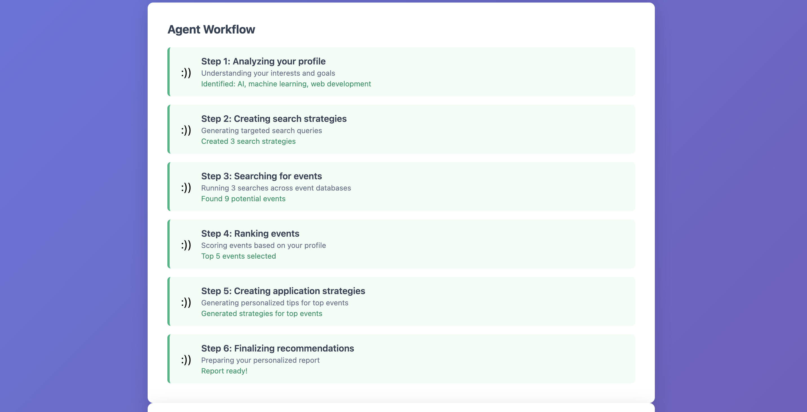
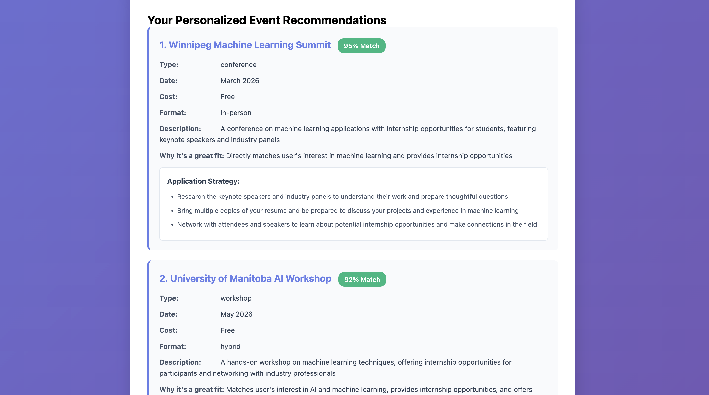
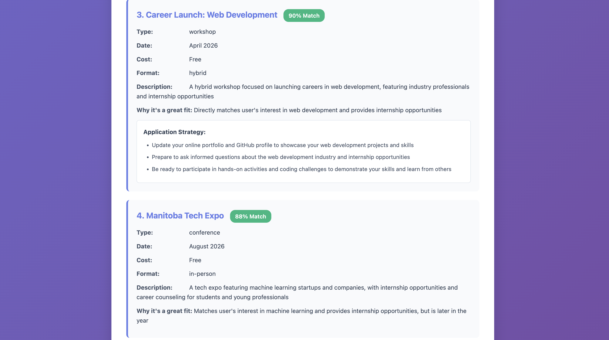

# AI Event Recommendation Agent

This project is a web based AI Agent that provides personalized event recommendations based on user profiles. The agent analyzes user inputs, generates search strategies, finds relevant events, ranks them according to fit, and provides application strategies. It includes a visual workflow that shows the agent’s progress in real time.

## Features
- Multi-step autonomous AI workflow with six steps:
  1. Analyze user profile
  2. Generate search strategies
  3. Find relevant events
  4. Rank and filter events
  5. Create personalized application strategies
  6. Compile final report

- Real time workflow visualization
- Match scoring system for events
- Personalized recommendations and application tips
- Example profiles for quick testing

## Visual Overview

### 1. User Profile Analysis

### 2. Search Strategy & Event Discovery

### 3. Ranking & Match Scoring

### 4. Final Report & Application Strategy

